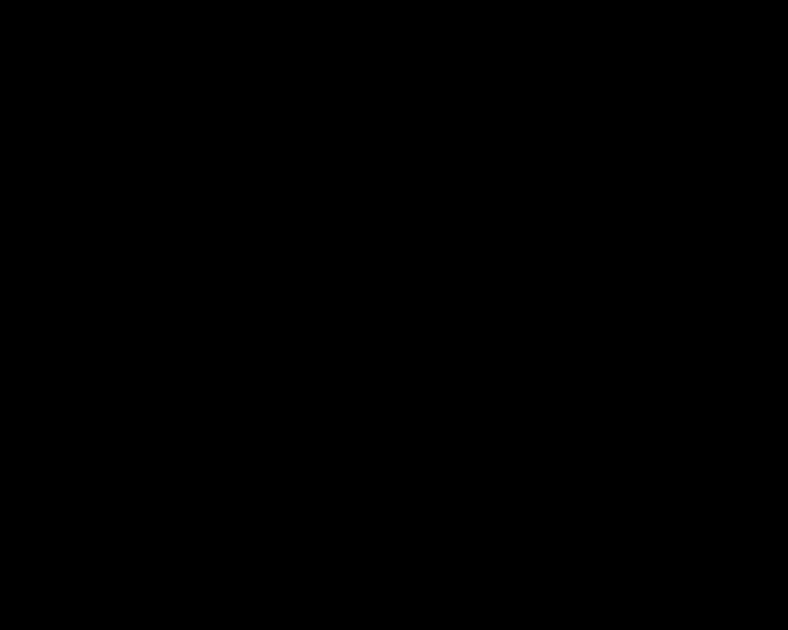

# 例子：Circle

直接看这些高阶的东西的定义，可能会让你感到困惑。所以，我们先来看一个例子：

我们定义一个 Circle \\(S^1\\) 的类型，它上面有

- 一个点 \\(base : S^1\\)，以及
- 一个（非平凡[^1]的） path \\(loop : base = base\\)


为了让这个类型真的“高阶”，我们需要让 \\(loop\\) 真的不平凡，即需要证明它不是 \\(refl\\)。

需要搞出这种两个东西不相等，我们通常使用的方法就是把它转化成证明 true ≠ false 的问题，which 我们非常清楚[^2]确实是不等的。

为了做到这一点，我们需要建立 \\(S^1\\) 和 \\(Bool\\) 之间的关联。

## 覆叠空间（Covering space）

不严谨地，某个类型/拓扑空间 上的 Covering space 就是一个可以符合如下要求的，映射到这个拓扑空间上的空间：

- 存在一组子空间，其中每个子空间都 同构[^3]于 原拓扑空间

\\(S^1\\) 有非常多的 Covering space，我们这里需要一个关于 \\(Bool\\) 的 Covering space：


这里有两个子空间（true, true ≡ false）和 (false, false ≡ true)，它们都同构（给出等价关系的函数是 not 函数）于 \\(S^1\\)。

### 将 \\(S^1\\) 映射到这个 Covering space

我们需要把 base 映射到 Bool 类型，loop 映射到 true ≡ false 类型。

在 agda 中我们先弄出 not 函数对应的 isomorphism，再（根据 Univalence 公理） 将其提升为 Bool 和自己之间的 path 。

```agda
IsomorphismNot : Iso Bool Bool
IsomorphismNot = iso not not section-not retract-not
    where 
        section-not : section not not
        section-not false i = false
        section-not true i = true
        retract-not : retract not not
        retract-not false i = false
        retract-not true i = true

notPath : Bool ≡ Bool
notPath = isoToPath IsomorphismNot
```

然后构造出 Bool 到 \\(S^1\\) 的覆叠空间：

```agda
not-cover : S¹ → Set
not-cover base = Bool
not-cover (loop i) = notPath i
```

然后我们给出将一个 Bool 类型的值沿着某个 not-cover 中的 path，相等到另一个 Bool 的函数：

```agda
-- Take a Bool, transport it along the corresponding path in not-cover
-- for example:
--     lift-to-cover true loop = false, means 
--         if transport `true` along the corresponding path of `loop`, ie. notPath, we get `false`
--     lift-to-cover true refl = true
--         if transport `true` along the corresponding path of `refl`, ie. still `refl`, we get `true`
lift-to-cover : Bool → base ≡ base → not-cover base
lift-to-cover b p = subst not-cover p b
```

使用这个函数，我们可以发现 true 沿着 loop 对应的 path 被相等到了 false，而沿着 refl 对应的 path （仍然是 refl） 被对应到了 true 本身，这说明这两个 path 是不等的。



如图即是 true 沿着 loop 对应的 path 被相等到了 false，图中无法表示 refl 对应的 path，因为这个 path “没有长度”。

最终我们可以写出如下的证明：

```agda
loop≢refl : ¬ (loop ≡ refl)
loop≢refl loop≡refl = true≢false (cong (lift-to-cover true) (sym loop≡refl))
```

## Circle 的 loop space

回忆 loop space 的定义：

$$
\Omega(A, a) := (a =\_A a, \text{refl}_a)
$$

我们可以看到，\\(S^1\\) 的 loop space 是：

$$
\Omega(S^1, base) := (base =\_A base, \text{refl}_{base})
$$

即这个类型是所有 base 到 base 的 path 的集合。

由于我们对 loop 是可以 `trans` 和 `sym` 的，即我们可以定义出：

$$
loop^n := loop \circ loop \circ \cdots \circ loop
$$

$$
loop^{-n} := (sym(loop))^n
$$

$$
loop^0 := refl
$$

我们可以看出，这些 base 到 base 的 path 似乎和整数集合 \\(\mathbb{Z}\\) 有点关系，实际上，我们可以证明这两个集合是等价的，即 \\(Ω(S^1) = Z\\)。

证明方式和证明 \\(loop ≠ refl\\) 的方式类似，我们先建立 \\(S^1\\) 和 \\(Z\\) 之间的关系，然后证明 \\(Z\\) 是 \\(S^1\\) 的 loop space，其中用到的 isomorphism 是 succ。

[^1]: 平凡的 path 是 refl。

[^2]: 这其实是可以证明的，可以通过建立 Bool 和 {⊤,⊥} 类型建立关系来证明，或者可以用 encode-decode 方法，通过证明 Bool 等价于 ⊤ + ⊤ 来证明。

[^3]: 应为：局部同胚，但这个术语 makes no sense to our target reader。
