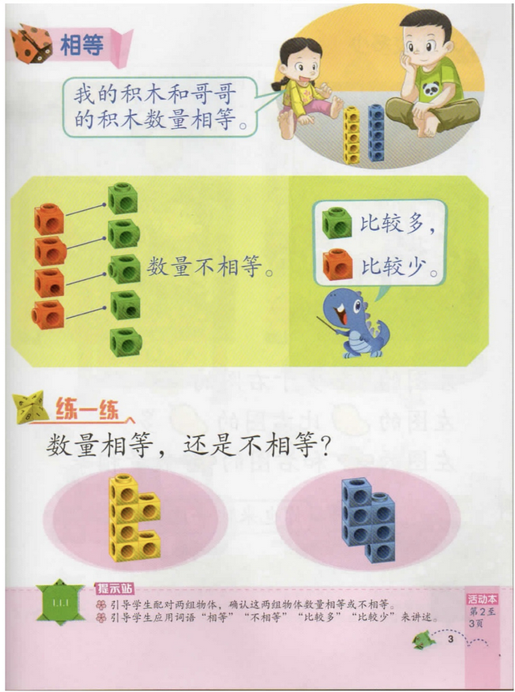
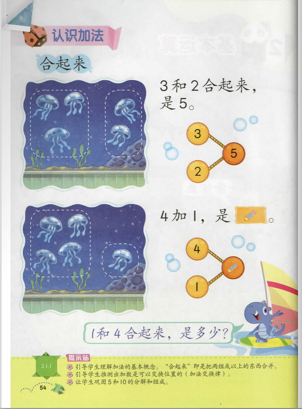
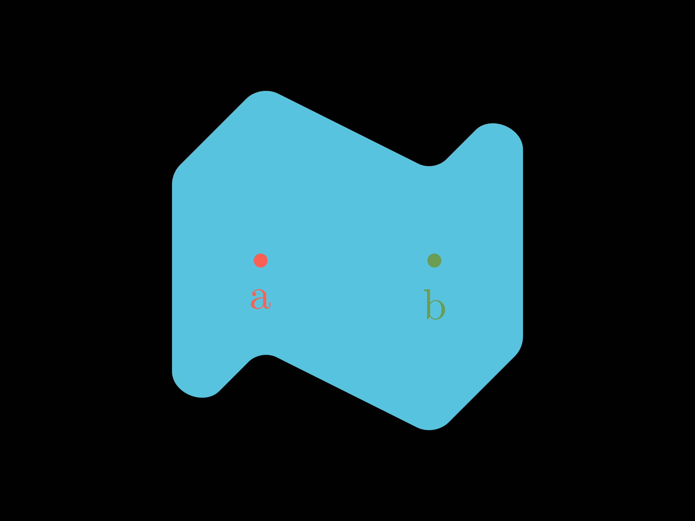

# 如何描述等于

## 什么是等于

我们在刚刚学习数学的时候，就学到了什么是相等的概念：



以及数字的概念：


以及加法的概念：



然而，我们忽略了一个问题：为什么实际的物体的合并可以映射到数字的加法上？

我们把两个水母和三个水母合并，数到了五个水母，为什么就能得到 2 + 3 = 5 这个结论呢？

有些想象力发达的小朋友就说了，2个物体和3个物体放在一起一定等于5个物体吗？我把2杯水和3杯面粉混合，得到了一个面团[^1]，这不是 2 + 3 = 1 吗？

根本问题在于，通过从实际生活中归纳得到的数学忽略了一些细节，因此不适用于更“严密”的数学研究，或者说用具体的物理世界里的规律反过来构造抽象的数学世界里的规律会产生问题，使得得到的结论的可适用范围存疑。[^2]

总而言之我们需要的是一个形式化的，对 “等于” 的定义。

## 不同类型的等于

### Judgemental Equal

这是内建在我们的推理规则中的等于，是无需/无法证明的。

这一种等于说明两个东西在我们的形式化里没有任何区别，可以直接互相替换。

如果两个东西的定义完全一致，我们称之为两者 Judgemental Equal。

在 Agda 中，Judgemental Equal 的东西可以直接互相替换，比如你把所有（至少有一个参数）函数 \\(f\\) 都替换成 `λ x → f x`，不会造成任何实质上的改变，因为在 Agda 中，这两个东西是 Judgemental Equal 的。

拿小学生都能理解的例子来说，2 = 2 这里的等于就可以是 Judgemental Equal [^3]，因为他们是完全一样的东西。

一般习惯把 Judgemental Equal 的等于写作 \\(≐\\)，比如 \\(2 ≐ 2\\)。

但 2 + 3 = 5 这里的等于就不是 Judgemental Equal，因为 2 + 3 和 5 显然长得不一样[^4]，两边的定义也不一致。

#### 哪些东西 Judgemental Equal

如果两个东西看起来完全一样，那么他们就是 judgemental equal 的，

对于一个 term：
$$
a ≐ a
$$

对于一个 type：

$$
A ≐ A
$$

给 term 中的子 term 改个名字（即用一个和这个子 term judgemental equal 的东西替换），改前改后是 Judgemental Equal 的：

$$
a ≐ a' ⊢ b[a/x] ≐ b[a'/x]
$$

类似地，对于依赖 \\(a\\) 的 type：

$$
a ≐ a' ⊢ B[a/x] ≐ B[a'/x]
$$

对一个函数使用 \\(λ\\) 抽象，和原函数是 Judgemental Equal 的：

$$
f ≐ λ x. f(x)
$$

相等的东西组成的 \\(\Pi\\) 类型也相等：

$$
A ≐ A' , B(x) \doteq B'(x) \vdash \Pi_{(x : A)} B(x) ≐ \Pi_{(x : A')} B'(x)
$$

### Propositional Equal / Identity Type

为了表示 2 + 3 = 5 里的等于，我们需要[^5]引入 identity type。

引入一个 type family \\(Id\\) （有时也写作 \\(=_A\\)）:

$$
Id_A : A → A → \mathcal{U}
$$

对于 \\(A\\) 类型的任意两个元素 \\(a\\) 和 \\(b\\)，\\(Id_A(a, b)\\) 就是根据 Curry-Howard 同构对应了 \\(a = b\\) 这个命题的类型，因此我们一般直接将这个类型写作 \\(a =_A b\\)[^6]，在对读者看出 \\(a\\) 和 \\(b\\) 类型的能力有信心时也直接写作 \\(a = b\\)。

在 Agda 中：

```agda
data _≡_ {a} {A : Set a} (x : A) : A → Set a where
  instance refl : x ≡ x
```

如果我们把 \\(A\\) 看作是一个平面，\\(a\\) 和 \\(b\\) 是这个平面上的两个点，那么 \\(a =_A b\\) 就是 \\(a\\) 和 \\(b\\) 之间的一条路径，因此我们也称 \\(a =_A b\\) 为 \\(a\\) 和 \\(b\\) 之间的 **path**。



如果 \\(a = b\\) 类型存在至少一个元素，我们就说 \\(a\\) 和 \\(b\\) 是 Propositional Equal 的，这个元素就是 \\(a\\) 和 \\(b\\) （Prepositionally）相等的一个证明。

#### 如何构造 Identity 类型的元素

我们定义 Judgemental Equal 的两个元素一定是 Propositional Equal 的，这可以体现为 Identity 类型的 formation rule:

$$
\text{refl} : \Pi_{(a : A)} a =_A a
$$

这个元素或者说证明说明 \\(a\\) 和他自身（或者和它 Judgemental Equal 的任何元素）都是等同的。

这是目前我们知道的 Identity 类型的唯一构造方式了，其他“创造” Identity 类型的元素的方式都需要引入一些公理。

##### Axiom J / Path Induction

最基本的一个公理是 Axiom J：

$$
J : C(x, x, refl) \to \Pi_{(x, y : A)} \Pi_{(p : x =_A y)} C(x, y, p)
$$

简单来说，这个公理假设如果我们能证明某个性质 \\(C\\) 对于 \\(\text{refl}: x = x\\) 成立，那么我们就可以证明这个性质对于任意 \\(x = y\\) 成立。

这个公理有时也被称为 path induction，因为它可以看作是：

- 以 “某个性质在 \\(\text{refl}\\) 上成立”为基本情况
- 外推到所有 \\(x = y\\) 的情况

时生成归纳证明的方法。

我们也可以“固定” path 的一个端点：

$$
J' : P(a, p) \to \Pi_{(x : A)} \Pi_{(p : a =_A x)} P(x, p)
$$

在 Agda 中：

```agda
postulate
  J' : {l1 l2 : Level} {A : Set l1} → {a : A} → {P : (x : A) → (a ≡ x) → Set l2} → 
    P  a         refl → 
      (x : A) → (p : a ≡ x) → 
    P  x         p
  
J : {l1 l2 : Level} {A : Set l1} → {C : (x y : A) → (x ≡ y) → Set l2} → 
  (x : A)               → C x x refl → 
  (y : A) → (p : x ≡ y) → C x y p
J {C = C} x base-holds y p = J' {a = x} {P = C x} base-holds y p
```

有了这个公理，我们可以导出 Identity 类型的一些性质：

#### 某个类型下的 Identity 类型是一个广群

用人话说，就是任何一个类型下的 Identity 类型，对于 Identity 类型的上的复合运算 \\(⋅\\)：

$$
\text{\_}⋅\text{_} : \Pi\_{(x,y,z:A)} (x = y) → ((y = z) → (x = z))
$$

来说：

- 有一个单位元 \\(\text{refl}\\)。
- 每个元素都有一个逆元素，比如 \\(x =_A y\\) 的逆元素就是 \\(y =_A x\\)
- 有结合律，
  比如给定\\(p: x =_A y\\)，
  \\(q: y =_A z\\)，
  \\(r: z =_A w\\)，
  我们可以得到 \\((𝑝 ⋅ 𝑞) ⋅ 𝑟 = 𝑝 ⋅ (𝑞 ⋅ 𝑟)\\)。

##### 复合运算的定义

就是简单的“等于的传递性”，因为 \\( (x = x) \to (x = z) \to (x = z) \\) 显然成立，所以可以用 path induction 来构造：

```agda
_⋅_ : {l : Level} {A : Set l} → {x y z : A} → x ≡ y → y ≡ z → x ≡ z
_⋅_ {A = A} {x} {y} {z} x≡y y≡z = J {C = λ (x : A) (y : A) (p : x ≡ y) → (y ≡ z) → (x ≡ z)} 
                                    x (λ x≡z → x≡z) y x≡y y≡z
```

##### 逆元素的定义

$$
\Pi_{(x, y : A)} (x = y) → (y = x)
$$

因为对 \\(\text{refl} : x = x\\) 显然成立，由 path induction 可得，对任意 \\(x = y\\) 成立。

```agda
sym : {l : Level} {A : Set l} → {x y : A} → x ≡ y → y ≡ x
sym {A = A} {x = x} {y = y} x≡y = J {C = λ (x : A) (y : A) (p : x ≡ y) → y ≡ x} 
                                    x (refl {x = x}) y x≡y 
```

#### Action on paths

对于函数 \\(f : A → B\\)，我们可以定义一个 action on paths of $f$：

$$
\text{cong}\_f : \Pi_{(x, y : A)} (x =_A y) → (f(x) =_B f(y))
$$

即对 Propositional Equal 的东西进行相同的一个操作之后还是 Propositional Equal 的。

\\(cong\\) 有时也写作 \\(ap\\)。

In Agda:

```agda
cong : {l1 l2 : Level} {A : Set l1} {B : Set l2} → (f : A → B) → {x y : A} → x ≡ y → f x ≡ f y
cong {A = A} f {x} {y} x≡y = J {C = λ (x : A) (y : A) (p : x ≡ y) → f x ≡ f y} 
                               x (refl {x = f x}) y x≡y
```

#### Transport/Substitution

我们可以把一个 term 中的某个子 term 替换成一个和他 Propositional Equal 的东西：

$$
subst : \Pi_{(x, y : A)} (x =_A y) → (P(x) → P(y))
$$

\\(subst\\) 有时也写作 \\(tr\\)。

In Agda:

```agda
subst : {l1 l2 : Level} {A : Set l1} {P : A → Set l2} → {x y : A} → x ≡ y → P x → P y
subst {A = A} {P = P} {x = x} {y = y} x≡y = J {C = λ (x : A) (y : A) (p : x ≡ y) → P x → P y} 
                                              x (λ t → t) y x≡y
```

我们将在下一章中看到，运用这些定律，我们可以证明 0 是自然数加法的单位元，自然数加法的结合律等。

Propositional Equal 是我们最常用的等于，我们将在后续章节中继续相关的讨论，比如通过引入其他一些公理来引入更多构造 Identity 类型的方法。

### Observational Equal

在面对具体的类型时，我们常常可以凭借“直觉”判断两个东西是否相等。

或者说，对于一个类型 \\(A\\) 我们可以定义一个二元关系 \\(Eq_A : A \to A \to \mathcal{U}\\)，在我们直觉认为相等的时候返回 \\(\top\\)，否则返回 \\(\bot\\)。

当这个二元关系返回 \\(\top\\) 的时候，我们就说这两个东西是 Observational Equal 的。

两个东西 Observational Equal 常常和两个 Propositional Equal 逻辑等价（即可以互相推出）的，如果能证明这一点，我们就可以将 Propositional Equal 上的各种性质应用到 Observational Equal 上，反方向上，由于 Observational Equal 的良好计算性质，我们也可以利用 Observational Equal 证明各种性质并应用到 Propositional Equal 上，我们将在之后的章节中研究如何建立这种联系。

我们将在下一章中研究自然数上的 Observational Equal。

[^1]: 这130%+的含水量不一定能成团，但是这不是重点😂。

[^2]: 如果看到这里你认为应该从一开始就让小学生接触这些东西，我可以告诉你布尔巴基学派替你试过了，输得一塌糊涂。相关讨论可以参考[这里](https://www.zhihu.com/question/380475691)，当然这里往下挖也可以牵扯到[认识论](https://zh.wikipedia.org/zh-hans/%E8%AE%A4%E8%AF%86%E8%AE%BA)，[科学哲学](https://zh.wikipedia.org/wiki/%E7%A7%91%E5%AD%A6%E5%93%B2%E5%AD%A6)，[数学是不是科学](https://www.zhihu.com/question/21169503)之类的问题。

[^3]: 思考：这里的两个 2 真的**完全**没有任何区别吗？在我们说 judgemental equal 的时候，我们需要什么上下文？

[^4]: 实际上这取决于加法和数字的定义。

[^5]: 根据 [Curry-Howard correspondence](https://en.wikipedia.org/wiki/Curry%E2%80%93Howard_correspondence) ，我们可以把类型理解为命题，这里的 identity type 就是一个 “=” 这一类命题所对应的类型，而这个类型的一个元素就是对这个命题的一个构造性证明。

[^6]: 要注意区别 \\(a =_A b\\), \\(a =_A \\), \\(=_A\\) 这三个类型。
